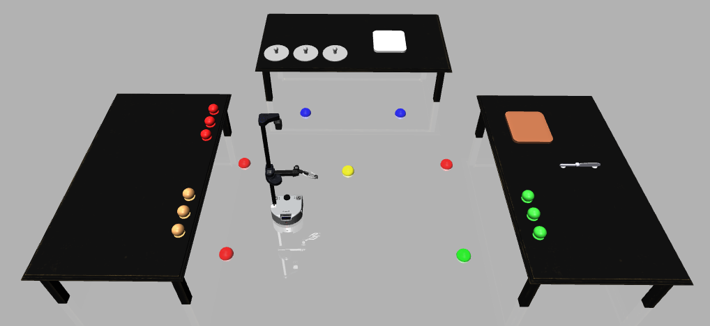

# Stretch 2 Simulation Environment

A high-fidelity MuJoCo-based simulation environment for the **Hello Robot Stretch 2** platform with ROS 2 integration and interactive control.



## Purpose

This simulation environment models a kitchen workspace designed for testing custom Reinforcement Learning models. The environment includes:

- **Kitchen Objects**: Knife, cutting board, plates
- **Pickable Ingredients**: Spherical colored objects representing lettuce (green), onion (white), and tomato (red)
- **Robot Compatibility**: All objects are specifically designed to be pickable by the Stretch 2 robot's gripper

The primary goal of this kitchen model is to test and validate custom Reinforcement Learning algorithms, specifically the [Macro MARL PPO](https://github.com/wwlin1198/macro_marl_ppo) model developed at Northeastern Laboratory.

## Features

- **Physics Simulation** - MuJoCo-based realistic robot dynamics
- **ROS 2 Integration** - Full ROS 2 communication stack
- **Interactive Control** - Command-line interface with action-based control
- **Autonomous Navigation** - Anchor-based navigation with turn-in-place
- **Real-time Visualization** - Live camera feed and 3D viewer
- **Action System** - YAML-defined micro and macro actions

## Quick Start

### Prerequisites

- Conda (Miniconda or Anaconda)
- ROS 2 Jazzy (optional, for ROS 2 features)
- Python 3.12

### Installation

```bash
# Clone repository
git clone <repository-url>
cd Stretch2_SimulationEnv

# Create environment
conda env create -f environment_ros2.yml
conda activate simenv_ros2
source /opt/ros/jazzy/setup.bash

# Verify setup
python verify_setup.py
```

### Running the Simulation

**Terminal 1: Start Simulation**
```bash
conda activate simenv_ros2
source /opt/ros/jazzy/setup.bash
python stretch_ros2_sim.py
```

**Terminal 2: Interactive Controller**
```bash
conda activate simenv_ros2
source /opt/ros/jazzy/setup.bash
python interactive_controller.py
```

## Interactive Controller

The interactive controller provides an elegant command-line interface:

```bash
stretch> help                    # Show all available actions
stretch> go_to_anchor anchor=A  # Navigate to anchor A
stretch> reset_arm              # Reset arm to default position
stretch> elevate_arm height=0.5 # Move lift to middle position
stretch> turn_towards anchor=ORIGIN  # Turn towards center
```

**Features:**
- Normalized parameters (0-1 range, where 0.5 = middle/default)
- Command history (↑/↓ arrow keys)
- Tab completion
- Action composition via macro actions

## Available Actions

### Navigation
- `go_to_anchor anchor=<A-F|ORIGIN> [speed=0.5]` - Navigate to anchor
- `turn_towards anchor=<A-F|ORIGIN> [speed=0.5]` - Turn towards anchor
- `go_to_position x=<0-1> y=<0-1> [direction=<0-1>] [speed=0.5]` - Navigate to position
- `align_with_target` - Turn towards the veggie (facing veggie so that ik can be implemented once base is fixed)
### Arm Control
- `reset_arm [speed=0.5]` - Reset arm to default position
- `elevate_arm height=<0-1> [speed=0.5]` - Set lift height
- `extend_arm length=<0-1> [speed=0.5]` - Extend/retract arm
- `rotate_wrist angle=<0-1> [speed=0.5]` - Rotate wrist yaw
- `open_gripper [speed=0.5]` - Open gripper fully
- `close_gripper [speed=0.5]` - Close gripper fully
- `set_gripper width=<0-1> [speed=0.5]` - Set gripper width

### Utility
- `wait duration=<seconds>` - Wait for duration
- `wait_for_arm [timeout=<seconds>]` - Wait until arm reaches target
- `compute_ik` - compute inverse kinematics

## Anchors

Predefined navigation points in the world:
- **A, B, C, D, E, F** - Table positions
- **ORIGIN** - Center point (average of all anchors)

## Project Structure

```
Stretch2_SimulationEnv/
├── stretch.xml                    # Robot model definition
├── table_world.xml                # World with tables and objects
├── actions.yaml                   # Action definitions
├── stretch_ros2_sim.py           # Main simulation node
├── interactive_controller.py     # Interactive command-line controller
├── stretch_keyboard_controller.py # Keyboard controller
├── navigation.py                 # Navigation controller
├── ik.py                         # Damped Pseudo jacobian inverse kinematics and alignment with target algorithm
└── assets/                       # 3D models and textures

```

## ROS 2 Topics

### Subscribed
- `/stretch/cmd_vel` - Base velocity commands
- `/stretch/joint_commands` - Joint position commands
- `/stretch/navigate_to_anchor` - Navigate to anchor
- `/stretch/turn_towards_anchor` - Turn towards anchor
- `/stretch/navigate_to_position` - Navigate to position
- `/stretch/reset_arm` - Reset arm command

### Published
- `/stretch/joint_states` - Current joint states
- `/stretch/navigation_active` - Navigation status
- `/stretch/camera/image_raw` - Camera feed

## Documentation

- **[SETUP.md](SETUP.md)** - Detailed setup instructions
- **[USAGE.md](USAGE.md)** - Complete usage guide
- **[actions.yaml](actions.yaml)** - Action definitions and examples

## Design Philosophy

- **Normalized Parameters** - All movement parameters use 0-1 range (0=min, 0.5=middle, 1=max)
- **Action Composition** - Macro actions built from micro actions
- **Speed Control** - All movements support speed control (0-1 range)
- **State Synchronization** - Joint states automatically sync with robot

## Resources

- [Stretch 2 Documentation](https://docs.hello-robot.com/)
- [MuJoCo Documentation](https://mujoco.readthedocs.io/)
- [ROS 2 Documentation](https://docs.ros.org/)


